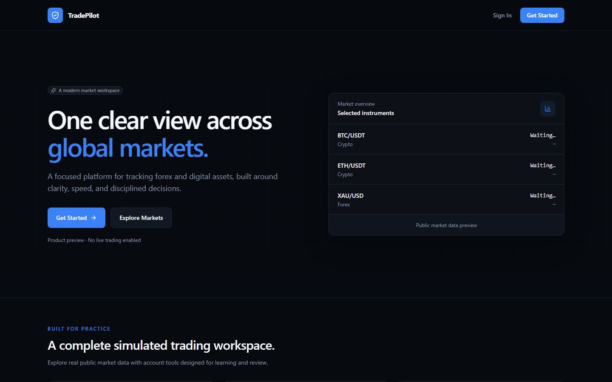
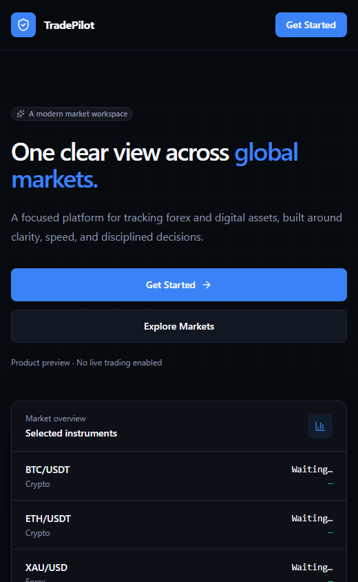
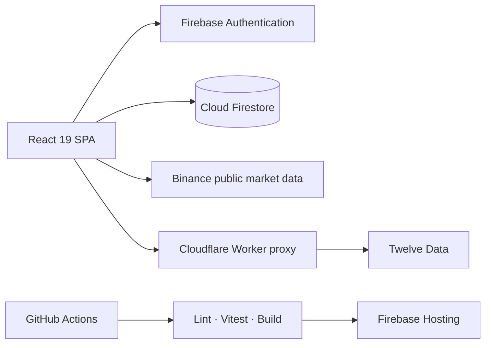

<div align="center">
  

  # TradePilot

  **A professional, dark-first workspace for simulated Crypto, Forex, and Gold trading.**

  Explore live public market data, practise disciplined execution, review portfolio performance,
  and test trading ideas—without sending an order to a real exchange or broker.

  [](https://github.com/UMAR010FAROOQ/tradepilot/actions/workflows/ci.yml)
  
  
  
  
</div>

---

## Product preview

<picture>
  
</picture>

<details>
  <summary><strong>Responsive preview</strong></summary>
  <br />
  <p align="center">
    
  </p>
</details>

## What TradePilot demonstrates

TradePilot is a portfolio project built around the workflows of a modern multi-asset trading product. It combines a compact financial interface with real public market data, a Firebase-backed account system, deterministic simulations, analytics, and guarded administration.

The project deliberately separates **market observation** from **trade execution**: quotes are real public data, while balances, orders, positions, and performance are simulated.

### Trading workspace

- Live Crypto quotes from Binance public endpoints.
- Forex and XAU/USD quotes through a Cloudflare Worker proxy.
- Interactive financial charts powered by Lightweight Charts.
- Simulated market and limit orders with long-only position accounting.
- Reduce-only exits, protective orders, pending orders, and live unrealized P/L.
- Active-trade management, transaction history, and CSV export.

### Market and performance intelligence

- Markets, watchlists, price alerts, and a configurable market screener.
- Strategy backtesting and historical market replay.
- Portfolio, equity, realized/unrealized P/L, and trading-performance analytics.
- Risk limits, position-sizing tools, exposure monitoring, and risk/reward calculations.
- Trading journal and reusable order/scanner presets.

### Account and administration

- Firebase email/password authentication with email verification.
- Protected user routes and role-gated administration.
- Profiles, wallets, notifications, and account-security workflows.
- Manual deposit and withdrawal request flows for supported Pakistani payment methods.
- Admin review tools for users, funding requests, trades, platform settings, and audit logs.

## Architecture



| Layer | Technology | Responsibility |
| --- | --- | --- |
| Interface | React 19, React Router, Tailwind CSS | Responsive routes, layouts, components, and stateful workflows |
| Charting | Lightweight Charts | Market charts and trading visualizations |
| Identity | Firebase Authentication | Email/password identity and verification |
| Data | Cloud Firestore | Profiles, wallets, simulated orders, positions, analytics, and admin records |
| Crypto data | Binance public HTTP/WebSocket APIs | Public Crypto pricing and updates |
| Forex data | Cloudflare Worker + Twelve Data | Server-side credential isolation for Forex and XAU/USD quotes |
| Quality | ESLint, Vitest, Firebase Rules Unit Testing | Static analysis, deterministic unit coverage, and rules validation |
| Delivery | GitHub Actions, Firebase Hosting | Validated production builds and Hosting deployment |

Read [ARCHITECTURE.md](./ARCHITECTURE.md) for subsystem boundaries, persistence, and security decisions.

## Engineering highlights

- **Provider abstraction:** Crypto, Forex, and metals can use different upstream providers without coupling the UI to provider-specific response formats.
- **Deterministic financial logic:** position averaging, break-even prices, realized P/L, risk/reward, and backtesting calculations live in testable utilities.
- **Security-first client design:** Firebase rules remain the authorization boundary; role and account-state changes update protected routes in real time.
- **Secret isolation:** the Twelve Data credential stays inside Cloudflare and never enters Vite browser variables.
- **Release safety:** pull requests and `main` builds run lint, deterministic tests, and a production build before Hosting deployment.
- **Honest simulation boundary:** no broker integration, custody, real-money execution, or misleading “live trading” behavior.

## Getting started

### Prerequisites

- Node.js 24
- npm
- A Firebase web app with Authentication and Firestore configured
- Firebase CLI and Java only when running Firestore emulator tests

### Installation

```bash
git clone https://github.com/UMAR010FAROOQ/tradepilot.git
cd tradepilot
npm ci
```

Create a local environment file from the documented template:

```bash
cp .env.example .env.local
```

On PowerShell, use `Copy-Item .env.example .env.local` instead.

Add the public Firebase web configuration to `.env.local`, then start Vite:

```bash
npm run dev
```

Open [http://localhost:5173](http://localhost:5173).

## Environment configuration

All `VITE_` values are embedded in browser assets and must be safe to expose.

| Variable | Required | Purpose |
| --- | --- | --- |
| `VITE_FIREBASE_API_KEY` | Yes | Public Firebase web-app configuration |
| `VITE_FIREBASE_AUTH_DOMAIN` | Yes | Firebase Authentication domain |
| `VITE_FIREBASE_PROJECT_ID` | Yes | Firebase project identifier |
| `VITE_FIREBASE_STORAGE_BUCKET` | Yes | Firebase web-app configuration |
| `VITE_FIREBASE_MESSAGING_SENDER_ID` | Yes | Firebase web-app configuration |
| `VITE_FIREBASE_APP_ID` | Yes | Firebase web-app identifier |
| `VITE_FOREX_API_BASE_URL` | Optional | Trusted Twelve Data-compatible proxy URL |
| `VITE_SUPPORT_EMAIL` | Optional | Public support address |
| `VITE_APP_VERSION`, `VITE_BUILD_ID`, `VITE_APP_ENV` | Optional | Public build metadata shown in support diagnostics |

The template also documents optional public receiving instructions for supported manual funding methods.

> Never place `TWELVE_DATA_API_KEY`, service-account JSON, passwords, PINs, OTPs, or private payment credentials in a `VITE_` variable.

## Available commands

| Command | Purpose |
| --- | --- |
| `npm run dev` | Start the local Vite development server |
| `npm run build` | Create an optimized production build |
| `npm run preview` | Preview the production build locally |
| `npm run lint` | Run ESLint across the project |
| `npm test` | Run Vitest in watch mode |
| `npm run test:run` | Run the fast deterministic test suite once |
| `npm run test:rules` | Run Firestore rules tests against the local emulator |
| `npm run validate` | Run lint, unit tests, and the production build |

The rules suite uses `firebase emulators:exec` and does not connect to production Firestore.

## Project structure

```text
src/
├── components/     Reusable UI, layout, chart, and trading components
├── config/         Build metadata and application configuration
├── context/        Authentication, wallet, and platform state
├── hooks/          Shared React hooks
├── layouts/        Public, authenticated, and admin shells
├── pages/          Route-level product screens
├── services/       Firebase, market-data, trading, and analytics services
├── styles/         Global Tailwind theme and design tokens
└── utils/          Pure financial, CSV, indicator, and backtest utilities

tests/
├── firestore-rules/  Emulator-backed authorization tests
└── *.test.*          Deterministic unit and component smoke tests
```

## Testing and release pipeline

Every pull request and push to `main` runs the CI quality gate on Node.js 24:

1. Install the locked dependency graph with `npm ci`.
2. Run ESLint.
3. Run deterministic Vitest tests.
4. Produce a clean Vite production build.

The production workflow repeats validation before deploying **Firebase Hosting only**. Firestore rules and indexes remain an intentional manual deployment:

```bash
firebase deploy --only firestore:rules,firestore:indexes
```

Preview deployments are intentionally disabled until the project has an isolated preview Firebase backend. See [GITHUB_DEPLOYMENT.md](./GITHUB_DEPLOYMENT.md) for the complete release setup.

## Security model

- Firebase web configuration is public by design; Firestore Rules enforce authorization.
- Normal users cannot directly mutate administrative records, wallet balances, or immutable trade history.
- Admin role and account status are evaluated by guarded routes and live profile state.
- Provider secrets stay outside the browser.
- Sensitive credentials are excluded from logs, exports, build metadata, and source control.

This remains a client-first Firebase Spark architecture. It does not provide the trusted custody, server-side execution, background processing, audit guarantees, or regulatory controls required for a real-money trading system.

## Contributing

See [CONTRIBUTING.md](./CONTRIBUTING.md) for development workflow, quality expectations, and pull-request guidance.

## Disclaimer

TradePilot is educational simulation software. It does not transmit orders to an exchange or broker, does not provide investment advice, and is not suitable for real-money execution.

---

<div align="center">
  Built as a full-stack product-engineering portfolio project focused on financial UX, deterministic simulation, and release safety.
</div>
