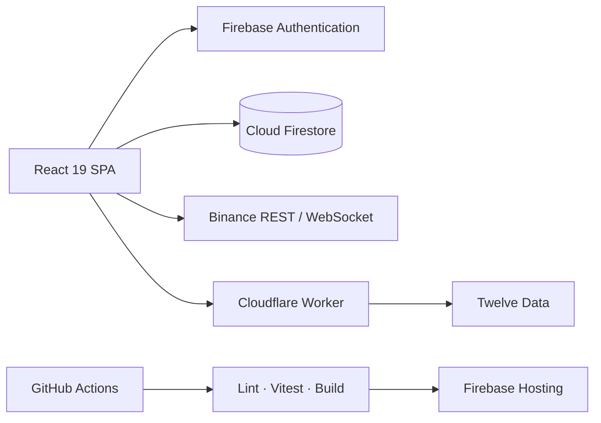

<div align="center">
  
  <h1>TradePilot</h1>
  <p><strong>TradePilot is a production-style simulated trading platform for Crypto, Forex, and Gold, built with React, Firebase, live market data, advanced risk controls, backtesting, analytics, and CI/CD.</strong></p>
  <p>
    <a href="https://tradepilot-3591a.web.app"><strong>Live Demo</strong></a>
    ·
    <a href="https://github.com/UMAR010FAROOQ/tradepilot"><strong>Repository</strong></a>
  </p>
  <p>
    <a href="https://github.com/UMAR010FAROOQ/tradepilot/actions/workflows/ci.yml"></a>
    
    
    
    
  </p>
  <p><strong>Simulation only:</strong> TradePilot does not execute real-money trades.</p>
</div>

---

## Product Preview

<picture>
  
</picture>

<details>
  <summary><strong>Responsive preview</strong></summary>
  <br />
  <p align="center">
    
  </p>
</details>

## Key Highlights

- Live Crypto data through Binance public REST and shared WebSocket subscriptions.
- Live Forex and XAU/USD data through Twelve Data and a secure Cloudflare Worker.
- Simulated market and limit orders with atomic wallet, position, and trade updates.
- Stop loss, up to three take-profit targets, trailing stop, break-even, and reduce-only exits.
- Risk controls for trade risk, position exposure, daily loss, and open-position limits.
- Strategy backtesting, historical market replay, and no-lookahead execution.
- Market screener, scanner presets, watchlists, price alerts, analytics, journal, and CSV export.
- Firebase Authentication, email verification, Firestore Security Rules, and role-gated administration.
- 59 deterministic unit and component tests, plus 7 Firestore Rules emulator cases.
- GitHub Actions validation and Firebase Hosting deployment from `main`.

## My Contribution

I designed and developed TradePilot end-to-end, including the frontend architecture, Firebase authentication and Firestore data model, simulated trading engine, live market-data integrations, risk-management layer, backtesting system, market screener, admin operations, automated testing, and CI/CD pipeline.

- Designed the React/Vite architecture, responsive application shells, and reusable UI system.
- Built Firebase Authentication, live Firestore data flows, transactions, and strict Security Rules.
- Integrated shared Binance WebSocket data and a Twelve Data-compatible Cloudflare proxy.
- Implemented simulated execution, advanced order protection, position accounting, and risk validation.
- Built backtesting, replay, screener, analytics, alerts, portfolio, and trading-journal workflows.
- Built admin operations, audit logs, feature flags, maintenance controls, and funding review flows.
- Added deterministic tests, GitHub Actions validation, and Firebase Hosting deployment.

## What This Project Demonstrates

- Frontend architecture for a complex, stateful React application.
- Real-time market-data integration and provider abstraction.
- Secure third-party API proxy design and secret isolation.
- Firebase identity, authorization, Firestore transactions, and rules design.
- Financial calculations, risk validation, position accounting, and analytics.
- Deterministic strategy backtesting and historical replay.
- Role-based admin operations and platform controls.
- Automated testing, CI/CD, production builds, and environment management.

## Core Features

### Trading Workspace

- Live multi-asset market overview and interactive Lightweight Charts.
- Long-only simulated market and limit orders with pending-order management.
- Active positions, realized/unrealized P/L, portfolio equity, and transaction history.
- Position sizing, protective exits, multi-target take profit, trailing stop, and break-even controls.

### Market and Performance Intelligence

- Markets, watchlists, alerts, market screener, and saved scanner presets.
- Moving-average, RSI, volatility, momentum, ATR, and breakout analysis.
- Backtesting with fees, adverse slippage, next-candle execution, equity curves, and drawdown.
- Performance analytics, risk dashboard, journal, order presets, and CSV exports.

### Account and Administration

- Email/password authentication, email verification, profiles, notifications, and security workflows.
- Manual deposit and withdrawal requests for supported Pakistani payment methods.
- Role-gated user, funding, trade, transaction, settings, and audit-log operations.
- Account suspension, maintenance mode, and platform-level feature controls.

## Architecture



TradePilot deliberately separates **market observation** from **trade execution**: quotes use real public market data, while balances, orders, positions, and performance remain simulated. See [ARCHITECTURE.md](./ARCHITECTURE.md) for subsystem and trust-boundary details.

## Engineering Decisions

### Firebase-first architecture

Firebase Authentication, Firestore, Security Rules, and Hosting provide a serverless, Spark-compatible foundation. Firestore transactions coordinate sensitive wallet, position, order, and trade state changes.

### Secure Forex proxy

The Twelve Data API key exists only as a Cloudflare Worker secret. The browser receives market data through the trusted proxy URL and never receives the provider credential.

### Shared and rate-aware market data

Crypto updates share Binance WebSocket subscriptions across consumers. Forex subscriptions use cached data, bounded polling batches, and a rotating cursor to avoid unnecessary provider requests.

### Client-side simulation boundary

Limit orders, alerts, SL/TP, trailing stops, break-even actions, and trading automation intentionally run client-side while TradePilot is open. Real-money execution would require a trusted backend and a new security review.

### Deliberate security deployment

Validated `main` commits deploy Firebase Hosting automatically. Firestore Rules and indexes remain a separate manual deployment so authorization changes are never coupled to a frontend release.

## Tech Stack

| Category | Technologies |
| --- | --- |
| Frontend | React 19, React Router, Vite, Tailwind CSS, Lightweight Charts, lucide-react |
| Backend / Platform | Firebase Authentication, Cloud Firestore, Firebase Hosting, Firestore Security Rules |
| Market Data | Binance public REST/WebSocket, Twelve Data, Cloudflare Workers |
| Testing / DevOps | Vitest, ESLint, Firebase Rules Unit Testing, Firebase CLI, GitHub Actions |

## Engineering Highlights

- Shared Binance stream management with subscriber lifecycle and reconnect handling.
- Batched, rate-aware Forex polling with caching and provider-neutral market services.
- Atomic Firestore transactions for simulated execution and funding administration.
- Rules-enforced wallet transitions, immutable trade history, and admin-only platform operations.
- Centralized financial math for fees, realized P/L, weighted entries, break-even, and sizing.
- Configurable risk validation that rechecks pending BUY orders before execution.
- Completed-candle signals with next-candle fills to prevent lookahead bias in backtests.
- Modular service architecture with responsive, semantic, and keyboard-accessible UI components.

## Getting Started

### Prerequisites

- Node.js 24 and npm.
- A Firebase web app with Authentication and Firestore configured.
- Firebase CLI and Java only for Firestore emulator tests.

### Installation

```bash
git clone https://github.com/UMAR010FAROOQ/tradepilot.git
cd tradepilot
npm ci
cp .env.example .env.local
npm run dev
```

On PowerShell, replace the copy command with `Copy-Item .env.example .env.local`. Add the public Firebase web configuration to `.env.local`, then open [http://localhost:5173](http://localhost:5173).

## Environment Configuration

Every `VITE_` value is embedded in browser assets and must be safe to expose.

| Variable | Required | Purpose |
| --- | --- | --- |
| `VITE_FIREBASE_API_KEY` | Yes | Public Firebase web-app configuration |
| `VITE_FIREBASE_AUTH_DOMAIN` | Yes | Firebase Authentication domain |
| `VITE_FIREBASE_PROJECT_ID` | Yes | Firebase project identifier |
| `VITE_FIREBASE_STORAGE_BUCKET` | Yes | Firebase web-app configuration |
| `VITE_FIREBASE_MESSAGING_SENDER_ID` | Yes | Firebase web-app configuration |
| `VITE_FIREBASE_APP_ID` | Yes | Firebase web-app identifier |
| `VITE_FOREX_API_BASE_URL` | Optional | Trusted Twelve Data-compatible proxy URL |
| `VITE_SUPPORT_EMAIL` | Optional | Public support address |
| `VITE_APP_VERSION`, `VITE_BUILD_ID`, `VITE_APP_ENV` | Optional | Public build and diagnostic metadata |

The template also documents optional public receiving instructions for supported manual funding methods.

> Never place `TWELVE_DATA_API_KEY`, service-account JSON, passwords, PINs, OTPs, or private payment credentials in a `VITE_` variable.

## Available Commands

| Command | Purpose |
| --- | --- |
| `npm run dev` | Start the Vite development server |
| `npm run build` | Create an optimized production build |
| `npm run preview` | Preview the production build locally |
| `npm run lint` | Run ESLint |
| `npm test` | Run Vitest in watch mode |
| `npm run test:run` | Run the deterministic unit/component suite |
| `npm run test:rules` | Run Rules tests against the Firestore emulator |
| `npm run validate` | Run lint, deterministic tests, and production build |

## Testing and Release Pipeline

The fast suite contains **59 deterministic automated tests** covering trading math, financial analytics, indicators, risk limits, scanner analysis, backtest mechanics, CSV safety, and component smoke behavior. A separate **7-case Firestore Rules suite** verifies profile isolation, wallet protection, immutable trades, role/status protection, restricted admin data, and admin-only platform settings.

Every pull request and push to `main` runs:

1. Locked dependency installation with `npm ci`.
2. ESLint validation.
3. The 59-test Vitest suite.
4. A clean Vite production build.

The production workflow repeats `npm run validate` before deploying the Firebase Hosting live channel. Rules tests require the Firebase CLI and Java and run only against the local emulator.

Firestore Rules and indexes remain an intentional manual release:

```bash
firebase deploy --only firestore:rules,firestore:indexes
```

See [GITHUB_DEPLOYMENT.md](./GITHUB_DEPLOYMENT.md) for repository variables, deployment credentials, and branch-protection setup.

## Project Structure

```text
src/
├── components/     Reusable UI, layout, chart, and trading components
├── config/         Build metadata and application configuration
├── context/        Authentication, wallet, risk, and platform state
├── hooks/          Shared React hooks
├── layouts/        Public, authenticated, and admin shells
├── pages/          Route-level product screens
├── services/       Firebase, market-data, trading, and analytics services
├── styles/         Global Tailwind theme and design tokens
└── utils/          Financial, CSV, indicator, scanner, and backtest utilities

tests/
├── firestore-rules/  Emulator-backed authorization tests
└── *.test.*          Deterministic unit and component smoke tests
```

## Security Model

- Firebase Authentication provides identity and email-verification state.
- Firestore Rules enforce ownership, active-account checks, and role-based authorization.
- Users cannot directly edit wallet balances or mutate filled trade records.
- Platform settings, private admin notes, audit logs, and funding decisions are admin-only.
- Role changes, account status, and protected routes respond to live profile state.
- The Twelve Data key remains in a Cloudflare Worker secret; no provider secrets enter frontend code.
- Sensitive credentials are excluded from exports, build metadata, and source control.
- Client-side automation works only while the authenticated application is open.

TradePilot's client-first Firebase architecture does not provide the custody, trusted execution, background processing, or regulatory controls required for real-money trading.

## Contributing

See [CONTRIBUTING.md](./CONTRIBUTING.md) for the development workflow, quality expectations, and pull-request guidance.

## Disclaimer

TradePilot is an educational and portfolio project for simulated trading. It is not a broker, exchange, investment service, or financial-advice platform. No real-money trades are executed.

---

<div align="center">
  Built as a personal software-engineering portfolio project focused on financial UX, deterministic simulation, security boundaries, and release safety.
</div>
